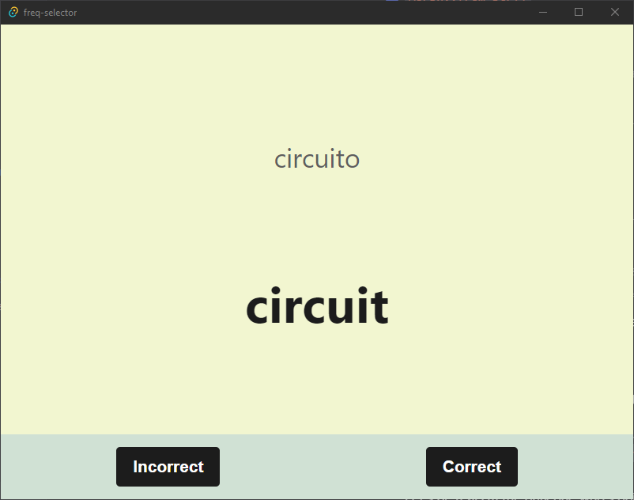
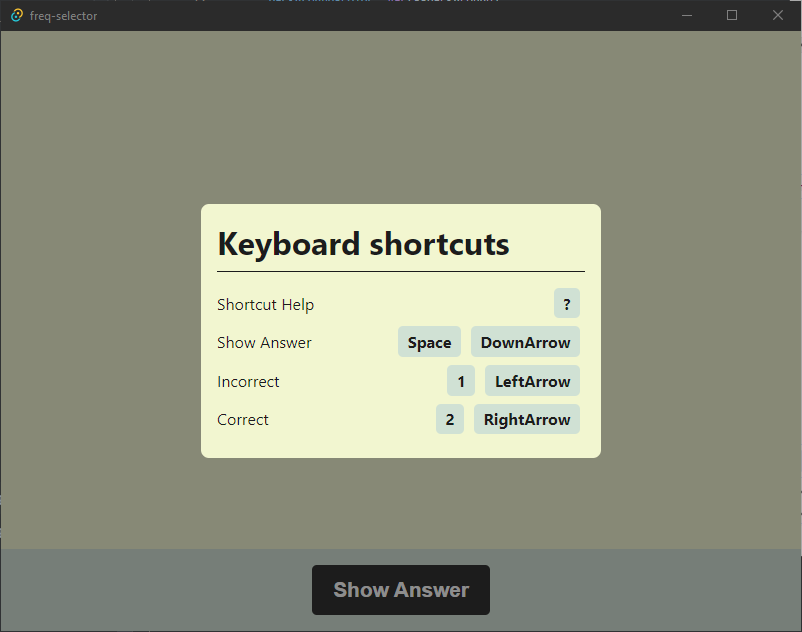

# Description

Tool to help manually create a spanish "known morphs" file for [AnkiMorphs](https://ankiweb.net/shared/info/472573498).

**Example output**: [`known.csv`](./readme/example-output.csv)

### Output Location

**Windows** ‒ `C:\Users\{Username}\AppData\Roaming\davidchung.vocab-vault\`

**Mac** ‒ `??`

**Linux** ‒ `??`

# Screenshots

    
    
    

